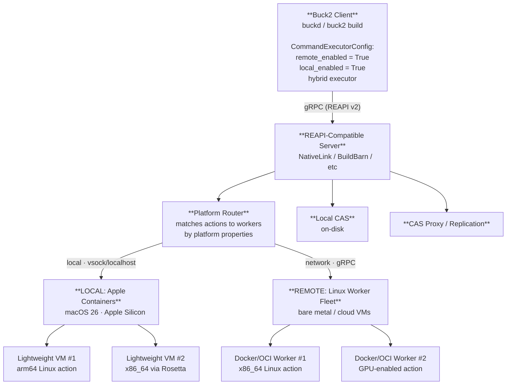
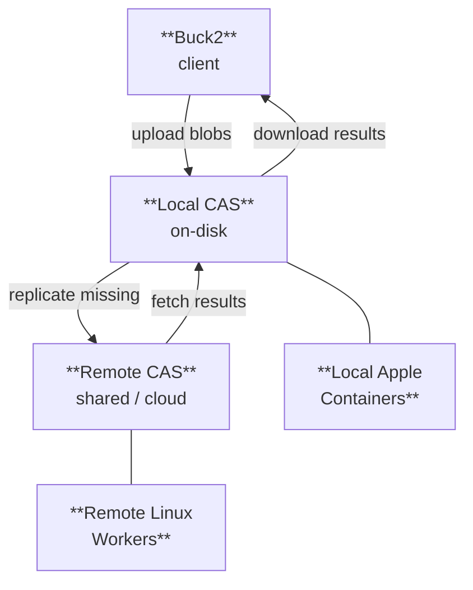
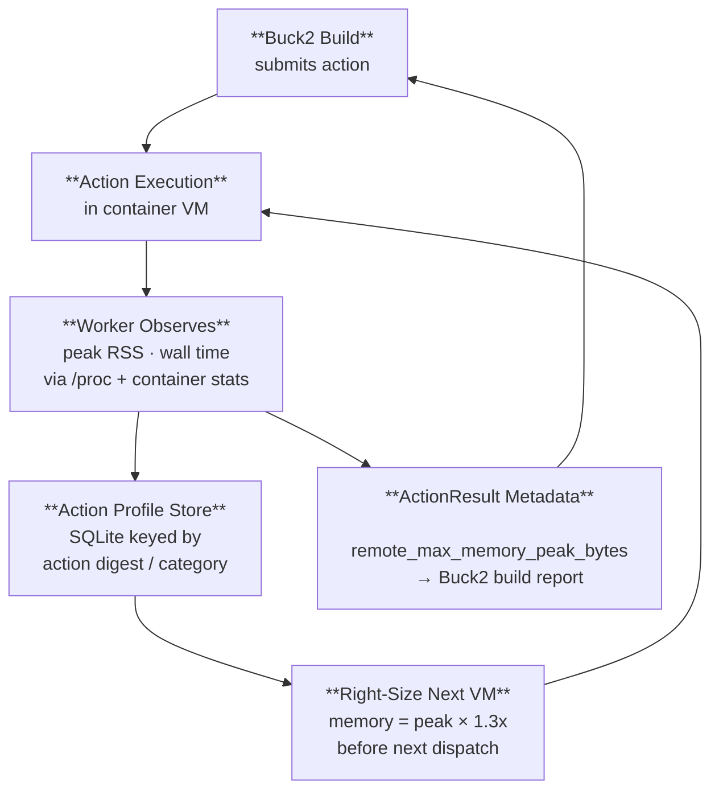
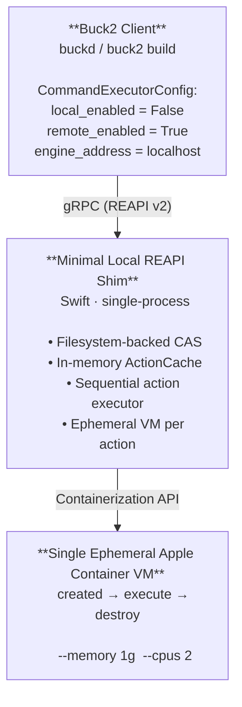
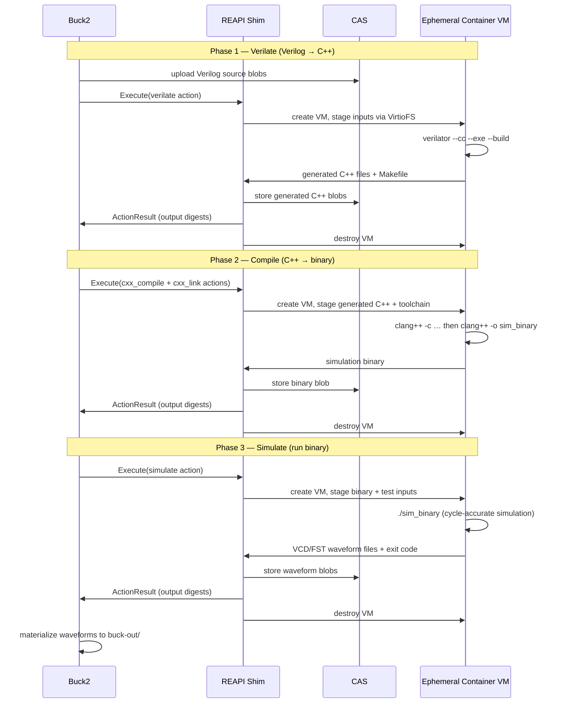
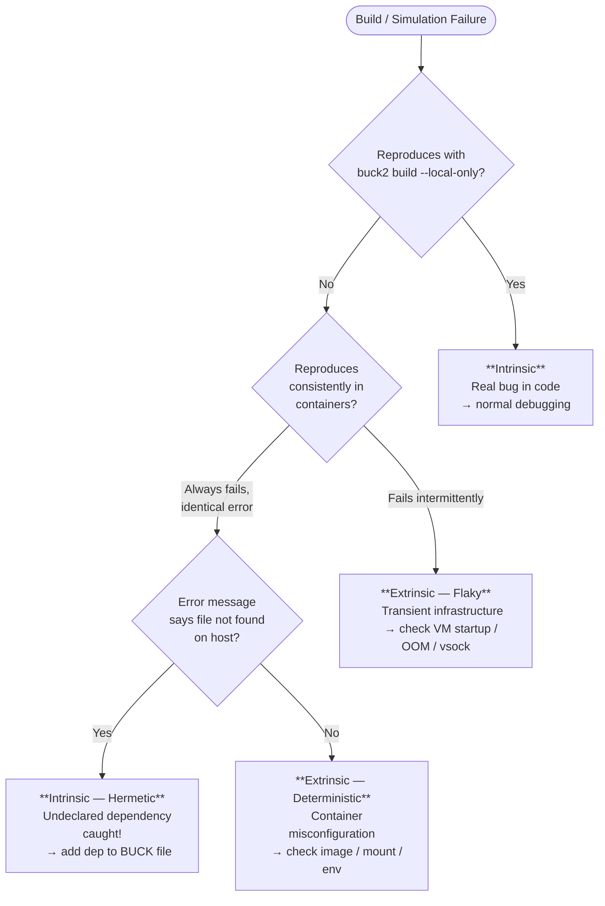
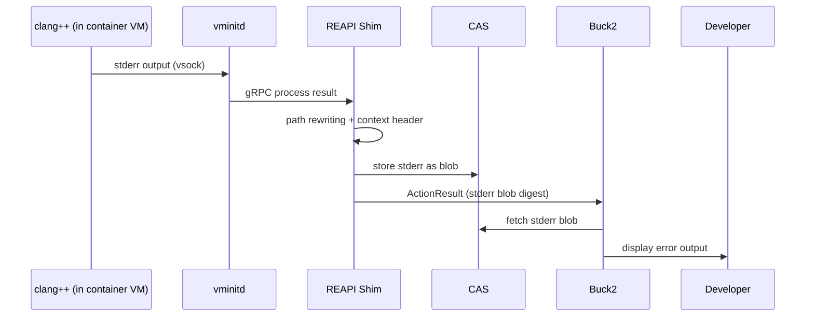
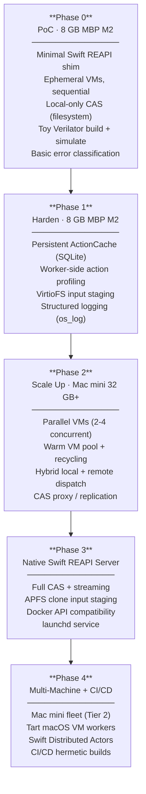

# REAPI + Buck2 (2025-12-01) with Apple Containers on macOS 26

## Proposal Outline

---

## Glossary of Key Terms

| Term | Definition |
|---|---|
| **CAS (Content-Addressable Storage)** | A storage system where every piece of data (a "blob") is identified by a cryptographic hash of its contents plus its size. Rather than storing files by name or path, CAS stores them by digest — a pair of (hash, size_bytes). If two files have identical contents, they share a single CAS entry, making deduplication automatic and lookups deterministic. In the REAPI, CAS stores everything: source files, compiled outputs, protobuf messages describing directory trees, command definitions, and action results. The core CAS operations are `FindMissingBlobs` (check which blobs the server already has), `BatchUpdateBlobs` (upload blobs), and `BatchReadBlobs` (download blobs). |
| **REAPI (Remote Execution API)** | A gRPC + Protocol Buffers specification for distributed build execution and caching, originally created by Google for Bazel and now an industry standard. Defines services for executing build actions on remote workers and caching results in CAS. |
| **Action** | An REAPI message combining a `Command` (the program to run and its arguments), an input root `Directory` tree digest, and platform requirements. The action's digest uniquely identifies the work to be done. |
| **ActionCache** | A mapping from action digests to their previously computed `ActionResult`. When a cache hit occurs, the build system skips execution entirely and retrieves outputs from CAS using the cached result's output digests. |
| **Digest** | A pair of (hash_string, size_bytes) that uniquely identifies a blob in CAS. Typically uses SHA-256. Two blobs with identical content always produce the same digest. |
| **Platform Properties** | Key-value pairs attached to an action specifying requirements for the worker that executes it (e.g., `OSFamily=linux`, `ISA=aarch64`, `container-image=ubuntu:22.04`). The REAPI server uses these to match actions to compatible workers. |
| **OCI (Open Container Initiative)** | Industry standard for container image formats and runtimes. Images from Docker Hub, GitHub Container Registry, and other registries conform to OCI specs, ensuring portability across container runtimes including Apple Containers. |
| **VirtioFS** | A shared filesystem protocol optimized for virtual machines, enabling high-performance file sharing between a host and guest VM with minimal overhead. Used by Apple Containers for directory sharing. |
| **vsock** | A socket family for communication between a virtual machine and its host, bypassing the network stack entirely. Apple Containers' `vminitd` uses gRPC over vsock for low-latency process management. |

---

## 1. Background: The REAPI and Buck2's Relationship to It

### 1.1 What Is the REAPI?

The Remote Execution API (REAPI) is a gRPC + Protocol Buffers specification originally developed by Google for Bazel, now an industry standard used by multiple build systems. It defines four core services:

- **Execution Service** — clients submit `Action` messages (a command + its input tree digest) and receive results asynchronously via long-running operations.
- **ActionCache Service** — maps action digests to previously computed results, enabling cache hits across builds and machines.
- **ContentAddressableStorage (CAS)** — stores blobs (source files, compiled outputs, protobuf messages) addressed by hash+size digests. Supports `FindMissingBlobs`, `BatchUpdateBlobs`, and `BatchReadBlobs`.
- **Capabilities Service** — allows clients to discover which API versions and features a server supports.

Workers are matched to actions via **platform properties** (key-value pairs such as `OSFamily=linux`, `container-image=...`).

### 1.2 Buck2's REAPI Integration (as of 2025-12-01 tag)

Buck2 implements REAPI client support via its `re_grpc` crate, connecting to any compliant server (BuildBarn, BuildBuddy, EngFlow, NativeLink, etc.). Key aspects of the 2025-12-01 release:

- **CommandExecutorConfig** in Starlark controls per-platform execution: `remote_enabled`, `local_enabled`, hybrid modes, cache uploads, queue time thresholds, and dynamic image selection.
- **Hybrid executor** allows racing local vs. remote, with fallback policies.
- **Content-based hashing** has been extended (notably to Swift anonymous targets), improving cache hit rates.
- **Instance name** is now configurable (was previously hardcoded as empty string in early OSS releases).
- **No local sandboxing** — Buck2 still does not sandbox local-only build steps. Hermeticity is enforced only via remote execution, where the RE server provides isolation (typically via Docker/OCI containers on Linux workers).

### 1.3 The Gap: Local Hermetic Builds Without a Remote Cluster

The original community "REAPI proposal" (GitHub issue #105 and related discussions) suggested Buck2's daemon (`buckd`) could expose a local REAPI-compatible endpoint, backed by a local container runtime, to provide:

- Hermetic local builds without standing up a full RE cluster.
- A unified code path (same REAPI protocol) for local and remote.
- A local CAS for caching.
- Container-based isolation for action execution.

This proposal has remained unimplemented in the mainline. The 2025-12-01 tag still relies on external RE servers for sandboxed execution.

---

## 2. Apple Containers on macOS 26: A New Execution Backend

### 2.1 What Apple Containers Provides

Announced at WWDC 2025, Apple's **Containerization** framework and **`container` CLI** are open-source Swift projects that run Linux containers natively on macOS 26 (Tahoe), with key architectural differences from Docker:

- **Per-container lightweight VMs** — each container runs in its own VM via `Virtualization.framework`, providing hypervisor-level isolation (not just namespace/cgroup isolation).
- **Sub-second startup** — optimized Linux kernel + minimal rootfs with `vminitd` (a Swift-based init system; no libc, no coreutils).
- **Dedicated IP addresses** per container — eliminates port-mapping complexity.
- **OCI compliance** — pulls standard images from Docker Hub and any OCI registry.
- **Rosetta 2 integration** — runs x86_64 container images on Apple Silicon.
- **Per-container directory sharing** — fine-grained; only the requesting container sees shared host directories.
- **gRPC over vsock** — `vminitd` exposes a gRPC API for process management.

### 2.2 Architecture Components

| Component | Role |
|---|---|
| `Containerization` Swift package | Core API: image management, VM lifecycle, networking |
| `container` CLI | User-facing tool (pull, run, build, exec) |
| `container-apiserver` | Launch agent; provides gRPC client API for container/network management |
| `container-core-images` | XPC helper for image management and local content store |
| `container-network-vmnet` | XPC helper managing vmnet virtual networking |
| `container-runtime-linux` | Per-container VM host process |
| `vminitd` | In-VM init; gRPC API over vsock for process launch, I/O, signals |
| `Virtualization.framework` | Apple's hypervisor API (Apple Silicon) |
| `vmnet` framework | Virtual networking (NAT, bridged, host-only; custom topologies in macOS 26) |

### 2.3 What This Means for Build Systems

Apple Containers can serve as a **local worker backend** for REAPI-style execution on macOS, replacing Docker Desktop. The per-container VM model provides stronger isolation than Docker's shared-kernel approach, and the dedicated IP/networking model simplifies service communication between build workers.

---

## 3. Proposed Architecture: Hybrid Local + Remote Dispatch with Apple Containers

### 3.1 High-Level Design

The architecture uses REAPI as a universal protocol layer, enabling Buck2 to dispatch actions to a mixed pool of local Apple Containers workers *and* remote Linux workers through a single interface. Buck2's client code does not need to distinguish between local and remote — the REAPI server handles routing.



### 3.2 Dispatch Strategy: How Actions Get Routed

The REAPI server routes each action based on **platform properties** declared in the action's `Command.platform` field. This is the standard REAPI mechanism — no custom extensions needed.

**Routing rules (configured in the REAPI server):**

| Action's Platform Properties | Routed To | Rationale |
|---|---|---|
| `OSFamily=linux`, `ISA=aarch64` | Local Apple Containers (native) | Fastest path; no network round-trip |
| `OSFamily=linux`, `ISA=x86_64` | Local Apple Containers (Rosetta) *or* Remote x86_64 worker | Rosetta for simple compilation; remote for architecture-sensitive workloads |
| `OSFamily=linux`, `requires-gpu=true` | Remote Linux worker (GPU-enabled) | Apple Containers lacks GPU passthrough |
| `OSFamily=linux`, `memory>16g` | Remote Linux worker (high-memory) | Large link steps, monolithic test suites |
| `OSFamily=macos` | Remote macOS VM (Tart / Virtualization.framework) | Xcode builds, macOS-specific tests |

**Buck2's hybrid executor** adds a client-side layer on top of this. When both `local_enabled` and `remote_enabled` are true, Buck2 can:

- **Race** local unsandboxed execution against remote sandboxed execution, using whichever finishes first.
- **Fall back** from remote to local (or vice versa) based on `remote_execution_queue_time_threshold_s`.
- **Upload local results** to the remote cache via `allow_cache_uploads`, so other developers benefit from locally-built artifacts.

### 3.3 CAS Federation: Sharing Artifacts Across Local and Remote

CAS federation is the critical enabler for hybrid dispatch. When an action executes remotely, the remote worker needs the input blobs; when it completes, Buck2 needs the output blobs. Several strategies exist:

**Strategy A: Single CAS with Network Access**
The REAPI server runs a single CAS that both local and remote workers access. Local workers reach it via localhost; remote workers reach it over the network. Simple but creates a bottleneck and requires the CAS to be network-accessible.

**Strategy B: CAS Proxy / Replication (Recommended)**
The REAPI server maintains a local CAS on the developer's machine and proxies to a shared remote CAS. Flow:

1. Buck2 uploads input blobs to the local CAS.
2. For local actions: the local worker reads directly from local CAS — zero network overhead.
3. For remote actions: the server runs `FindMissingBlobs` against the remote CAS, uploads only what's missing, then dispatches the action.
4. Remote action results are fetched back to local CAS on demand.

This is how BuildBarn's `bb_storage` and NativeLink's CAS proxy work. The developer's machine acts as a caching tier closest to the user.

**Strategy C: Buck2's Built-in Cache Uploads**
Even without server-side CAS federation, Buck2's `allow_cache_uploads = True` in `CommandExecutorConfig` uploads locally-executed action results to the remote cache. This means a developer who builds locally with Apple Containers automatically populates the shared remote cache for the team.



*Blob flow: upload pushes missing blobs toward workers; download pulls results back toward client.*

### 3.4 Component Responsibilities

**REAPI Server** (existing implementation, configured for hybrid):

- Implements `Execution`, `ActionCache`, and `ContentAddressableStorage` gRPC services.
- Routes actions to local or remote workers based on platform properties and load.
- Manages CAS proxy/replication between local and remote storage.
- Listens on a Unix socket or localhost TCP port for Buck2, and on a network port for remote workers.

**Local Worker Manager** (Apple Containers backend):

- Receives actions from the REAPI server.
- For each action: pulls the required OCI image (per platform properties), stages the input root via VirtioFS or directory sharing, launches a container, executes the command, captures outputs.
- Pools warm containers for repeated builds with the same toolchain image.
- Reports worker platform properties to the server: `OSFamily=linux`, `ISA=aarch64`, available memory/CPU.

**Remote Worker Fleet** (standard REAPI workers):

- Any existing REAPI worker implementation (BuildBarn's `bb_worker`, NativeLink workers, BuildBuddy executors).
- Runs on Linux bare metal or cloud VMs.
- Advertises its own platform properties (ISA, GPU availability, installed toolchains).
- Communicates with the same REAPI server (or a federated server cluster).

**Input/Output Staging**:

- Local: Uses Apple Containers' per-container directory sharing to mount the CAS-staged input tree. After execution, reads output files and stores in local CAS.
- Remote: Standard REAPI blob transfer — the server ensures inputs are present in the remote CAS before dispatching `Execute()`.

### 3.5 Configuration in Buck2 Starlark

```python
# Platform definition for hybrid execution
CommandExecutorConfig(
    local_enabled = True,          # unsandboxed local fallback
    remote_enabled = True,         # REAPI dispatch (local containers + remote)
    use_limited_hybrid = True,     # race local vs remote
    allow_cache_uploads = True,    # push local results to shared cache
    remote_execution_queue_time_threshold_s = 5,  # fall back if RE queue > 5s
    remote_execution_use_case = "hybrid-apple-containers",
)

# .buckconfig
# [buck2_re_client]
# engine_address = grpc://localhost:8980    # local REAPI server
# instance_name = "default"
#
# The local REAPI server handles routing to both
# local Apple Containers and remote Linux workers.
```

### 3.6 Multi-Tier Execution Model

For teams with varying infrastructure, the architecture supports a tiered dispatch model:

| Tier | Infrastructure | Actions | Latency | Use Case |
|---|---|---|---|---|
| **Tier 0: ActionCache hit** | Local or remote CAS | None (cached result) | Milliseconds | Unchanged source; teammate already built this |
| **Tier 1: Local Apple Containers** | Developer's Mac (macOS 26) | Compilation, codegen, linting, unit tests | Sub-second startup + execution time | Fast iteration loop; hermetic local builds |
| **Tier 2: Local Mac fleet** | Mac minis / Studios on LAN | Overflow from Tier 1; shared builds | Low network latency | CI/CD; team-shared build capacity |
| **Tier 3: Remote Linux cluster** | Cloud VMs / bare metal | x86_64-native, GPU, high-memory, integration tests | Higher latency (network + queue) | Workloads that can't run locally |

Buck2 doesn't need to be aware of these tiers explicitly. The REAPI server's platform property matching and queue management handle tier selection automatically. From Buck2's perspective, it submits actions and gets results — the routing is transparent.

---

## 4. Implementation Considerations

### 4.1 CAS Implementation and Caching

The CAS is the backbone of the entire system — every input file, output artifact, command definition, and directory tree flows through it. Choosing the right CAS implementation and topology is the highest-impact decision in this architecture.

**Server options for macOS/arm64:**

- **NativeLink** (Rust, Apache-2.0 + FSL-1.1-ALv2): Particularly appealing since it's written in Rust (like Buck2), compiles natively for arm64 macOS, and supports both CAS and execution services. Its CAS proxy capabilities make it a natural fit for the hybrid CAS federation model described in §3.3.
- **Buildbarn** (Go, Apache-2.0): Mature, widely deployed, modular architecture. The `bb_storage` component handles CAS with configurable backends (filesystem, S3, etc.) and supports CAS replication between instances.
- **bazel-remote** (Go, Apache-2.0): Lightweight, cache-only (no execution service). Good for a minimal local CAS if execution is handled separately.
- **Custom Swift implementation**: A minimal CAS backed by Apple's filesystem APIs could leverage APFS clones for zero-copy blob deduplication. Potentially the highest-performance option for the local tier, but significant development effort.

**Local CAS performance considerations:**

- APFS copy-on-write and cloning can make CAS blob storage nearly free for duplicate content.
- The local CAS should be on the Mac's internal SSD (NVMe), not external storage.
- For the CAS proxy/replication pattern (§3.3 Strategy B), the local CAS acts as an LRU cache with configurable size limits, evicting cold blobs that can be re-fetched from the remote CAS.

### 4.2 Container Lifecycle and Performance

- **Warm pools**: Pre-start a pool of lightweight VMs with common toolchain images. The sub-second startup makes cold starts tolerable, but warm pools eliminate even that overhead for repeated actions.
- **Parallelism**: Apple Containers allocates resources on-demand per container. The worker manager should respect system CPU/memory limits and queue actions accordingly.
- **Input root as filesystem root**: Some build systems (BuildStream) require the input root to be treated as the absolute filesystem root in the container. Verify this behavior with `vminitd`'s mount configuration.

### 4.3 Networking

- For build actions that don't require network access (most compilation), containers can run in isolated/host-only mode.
- For actions that need to fetch dependencies (e.g., package manager resolution), vmnet's NAT mode provides outbound connectivity.
- macOS 26's custom network topologies enable more sophisticated setups if needed.

### 4.4 Cross-Architecture Support

- **arm64 actions**: Native execution on Apple Silicon.
- **x86_64 actions**: Rosetta 2 integration allows running x86_64 container images transparently. This is critical for organizations migrating from x86 Linux build infrastructure.
- **Platform properties mapping**: `OSFamily=linux`, `ISA=aarch64` (or `x86_64`) map to container image selection and Rosetta configuration.

### 4.5 Memory Management: The VM Reclamation Problem

This is the most significant operational concern for a native Swift implementation using Apple Containers as REAPI workers.

#### 4.5.1 The Problem in Detail

Apple's `Virtualization.framework` allocates host physical memory pages to a guest VM on demand. When a container starts with `--memory 16g`, it doesn't immediately consume 16 GB — only what the guest Linux kernel actually touches. This demand-paging works well for the "grow" direction.

The problem is the return trip. When a build action completes and its process exits inside the container VM, the Linux kernel reclaims those pages into its own free list. But from macOS's perspective, those pages remain mapped to the VM. The host has no visibility into the guest's page table, so it cannot distinguish "free inside the guest" from "in use by the guest." The result is that each container VM's host memory footprint is a monotonically increasing high-water mark that never decreases.

Apple's documentation states this directly: the macOS Virtualization framework implements only partial support for memory ballooning, and memory pages freed to the Linux guest OS are not relinquished to the host.

#### 4.5.2 Why This Matters for Build Workers

Build actions are inherently bursty. A C++ template-heavy compilation might allocate hundreds of megabytes for instantiation, then exit. A linker might spike to several gigabytes. In the per-container-VM model, each action's peak memory becomes a permanent high-water mark for that VM. Over the course of a build with hundreds of actions across a pool of warm containers, host memory steadily climbs without ever dropping — even if every container is idle.

On a 32 GB MacBook Pro running 8 warm containers, this can exhaust physical memory within a single large build, forcing macOS into aggressive swap and compression, degrading both build performance and the rest of the developer's workflow.

#### 4.5.3 Background: How Memory Ballooning Works (and Doesn't)

The standard solution in virtualization is the **VirtIO memory balloon device**. The protocol works as follows:

1. The host tells the guest balloon driver to "inflate" to a target size.
2. The guest balloon driver allocates pages from the guest kernel, effectively claiming them.
3. The guest reports the guest-physical addresses of those pages to the host.
4. The host decommits the backing physical memory, making it available for other processes.
5. When the guest needs memory back, the balloon "deflates" — the guest reclaims the pages, and the host allocates new physical pages on the next access (a standard page fault).

Apple's `Virtualization.framework` does expose a balloon device (`VZVirtioTraditionalMemoryBalloonDevice`), and the Containerization framework's optimized kernel includes VirtIO drivers. However, the current implementation only fully supports demand-paging (host → guest allocation). The bidirectional inflate/deflate reclaim cycle is not fully wired up on the host side.

There is also a newer mechanism called **free page reporting** (`VIRTIO_BALLOON_F_FREE_PAGE_HINT`), available in Linux kernels 5.x+. With free page reporting, the guest proactively tells the host about pages it's not using (in 2-4 MB blocks), and the host decommits them — no explicit balloon inflation needed. This is more efficient for workloads with frequent allocation/deallocation cycles (exactly like build actions). But this also requires host-side support that Apple hasn't shipped yet.

#### 4.5.4 Mitigation Strategies for a Native Swift Implementation

**Strategy 1: Ephemeral VMs (Recommended for initial implementation)**

Instead of maintaining warm, long-lived containers, destroy and recreate them after each action (or after a configurable number of actions). Since Apple Containers achieves sub-second startup, the penalty per action is small relative to typical compilation times.

The Swift worker manager would:
- Start a fresh lightweight VM for each action (or batch of actions).
- Execute the action.
- Capture outputs to CAS.
- Destroy the VM, which immediately releases all host memory.

This turns the "limitation" into an architectural advantage: every action starts with a clean filesystem (hermetic by default), and memory never accumulates. The tradeoff is the ~500ms-1s startup overhead per action, which is negligible for actions taking more than a few seconds but adds up for very fast actions (e.g., header-only compilation, code generation).

**Strategy 2: Right-Sizing VM Memory Limits Per Action**

Instead of giving every container a generous memory ceiling, the worker inspects action metadata to set tight `--memory` limits. A compilation action might get 2 GB; a link action gets 8 GB; a code generator gets 512 MB. Smaller limits mean lower high-water marks even if memory isn't reclaimed.

This pairs naturally with Buck2's observability data (see §4.6) and the REAPI's platform properties mechanism.

**Strategy 3: Hybrid Pool with Automatic Recycling**

Maintain a small pool of warm VMs for low-latency action dispatch, but track each VM's memory high-water mark (visible via macOS Activity Monitor APIs / `proc_pidinfo`). When a VM's host memory footprint exceeds a threshold (e.g., 2x its configured limit, or an absolute cap), recycle it — destroy and replace with a fresh VM.

The Swift implementation could expose this as a configuration:
```swift
struct WorkerPoolConfig {
    let warmPoolSize: Int           // e.g., 4 VMs
    let maxMemoryPerVM: UInt64      // e.g., 4 GB
    let recycleThreshold: Double    // e.g., 1.5x — recycle at 6 GB actual
    let maxActionsBeforeRecycle: Int // e.g., 50 — force recycle periodically
}
```

**Strategy 4: Host-Side Balloon Control (Experimental)**

Since the native Swift implementation has direct access to `VZVirtioTraditionalMemoryBalloonDevice`, between actions the worker could attempt to inflate the balloon inside idle VMs to force the guest kernel to release cached pages. Even if Apple's framework doesn't fully decommit the backing memory today, this may trigger macOS's memory compression to reclaim some physical pages, and positions the implementation to benefit immediately when Apple ships full balloon support.

**Strategy 5: Monitor and Alert**

Regardless of which primary strategy is used, the worker should continuously monitor:
- Per-VM host memory footprint (via `proc_pidinfo` or `mach_task_info`).
- Total host memory pressure (via `dispatch_source_create(DISPATCH_SOURCE_TYPE_MEMORYPRESSURE, ...)`).
- Under memory pressure, aggressively recycle idle VMs and reduce the warm pool size.

#### 4.5.5 Outlook

Apple is actively developing the Containerization framework (now at v0.26.x with frequent releases). The macOS 26 release added ASIF, custom vmnet topologies, and other VM improvements. Full balloon reclaim or free page reporting support could land in a point release or macOS 27. Building on the native Swift APIs ensures the implementation is positioned to adopt it immediately.

### 4.6 Buck2 Observability: Historical Job Metrics and Right-Sizing

A key question for memory-aware VM management is: how does the worker know how much memory an action will need *before* it runs? Buck2 provides several observability mechanisms, but does not currently have a built-in feedback loop for automatically right-sizing actions.

#### 4.6.1 What Buck2 Provides Today

**Build Reports** (`--build-report` / `--streaming-build-report`):

Buck2's build report includes per-target aggregated metrics, including `remote_max_memory_peak_bytes` and `local_max_memory_peak_bytes` — the maximum peak memory across all actions for remote and local execution respectively. It also tracks `local_execution_time_ms`, `remote_execution_time_ms`, `remote_cache_hits`, `declared_actions`, and `full_graph_output_size_bytes`. These are amortized across targets that share intermediate actions.

The streaming build report writes JSON lines during the build, so metrics can be consumed in real-time.

**Event Logs** (`buck2 log`):

Buck2 records detailed event logs for every build. The `buck2 log` command can show the critical path (`buck2 log critical-path`), filter actions by category (`--filter-category cxx_compile`), and replay builds. Individual action execution times and categories are available, though per-action memory usage from the worker is not surfaced in the standard event log — it comes from the RE server's action result metadata.

**REAPI ActionResult Metadata**:

The REAPI `ActionResult` message includes an `execution_metadata` field with `worker_start_timestamp`, `worker_completed_timestamp`, and other timing data. Some REAPI servers (BuildBuddy, EngFlow) extend this with peak memory and CPU usage per action. This metadata flows back through Buck2's build report as `remote_max_memory_peak_bytes`.

**Starlark Profiling**:

Buck2's `--profile-patterns` flag supports heap profiling of Starlark evaluation (analysis and loading phases), measuring allocated and retained memory in the Starlark interpreter. This is useful for optimizing rule definitions but does not cover action execution memory (the memory used by compilers, linkers, etc. running inside containers).

**Action Key Configuration**:

`CommandExecutorConfig.remote_execution_action_key` allows injecting variability into action keys — the documentation explicitly notes this is used by RE systems for things like "expected memory utilization." This is the intended extension point for memory-aware scheduling, but it requires the *user* to set it correctly per build mode.

#### 4.6.2 What Buck2 Does NOT Provide

- **No automatic per-action memory tracking for local execution.** When actions run locally (unsandboxed), Buck2 does not measure their peak RSS. This data only exists when actions run via RE, and only if the RE server records it.
- **No historical database of action resource usage.** Buck2 does not maintain a persistent store of "action X typically uses Y MB of memory." Each build's metrics are available in that build's report/event log, but there is no built-in aggregation across builds.
- **No feedback loop to rule definitions.** There is no mechanism where Buck2 observes that a `cxx_link` action used 6 GB last time and automatically adjusts its `remote_execution_properties` or resource requirements for the next build.
- **No local resource estimation.** Unlike Bazel's `--local_ram_resources` which caps concurrent local actions based on estimated memory, Buck2's `--num-threads` (`-j`) controls concurrency by thread count only, not by memory budget.

#### 4.6.3 Opportunity: Worker-Side Resource Tracking and Feedback

This is where a native Swift REAPI worker implementation can add significant value beyond what Buck2 provides natively. The worker sits in the perfect position to observe actual action resource consumption and feed it back.

**Worker-Side Memory Tracking:**

The Swift worker can observe each action's actual memory usage inside its lightweight VM by:
- Querying `container stats` (or the underlying `vminitd` gRPC API) during execution for real-time memory metrics.
- Reading `/proc/<pid>/status` (VmPeak, VmRSS) from inside the VM via vsock after the process exits.
- Recording the host-side memory high-water mark for the VM process (`proc_pidinfo` on macOS).

**Persistent Action Profile Store:**

The worker can maintain a local database (SQLite or flat file) keyed by action digest or action category, storing:
- Peak memory usage (observed).
- Execution wall time.
- Input tree size.
- Timestamp.

Over successive builds, this builds a historical profile of each action type's resource requirements.

**Right-Sizing VM Allocation:**

Before launching a VM for an action, the worker consults the profile store:
1. Look up the action's digest — has this exact action been seen before?
2. If not, look up by action category (e.g., `cxx_compile`, `cxx_link`, `swift_compile`) for a statistical estimate.
3. Set the VM's `--memory` limit to `observed_peak * safety_margin` (e.g., 1.3x).
4. If no history exists, use a conservative default.

**Feedback via REAPI ActionResult Metadata:**

The worker can populate the REAPI `ActionResult.execution_metadata` with observed resource metrics. Buck2 already reads this for `remote_max_memory_peak_bytes` in its build report. Over time, this data can flow into dashboards, alerting, and potentially into BXL scripts that adjust rule definitions.

**BXL-Based Automation (Advanced):**

Buck2's BXL (Buck Extension Language) can introspect the build graph and run custom logic. A BXL script could:
1. Parse previous build reports to extract per-action-category memory statistics.
2. Generate or update platform definitions with appropriate `remote_execution_properties` reflecting observed resource needs.
3. Run as a pre-build step or CI check to keep resource estimates current.

This creates a feedback loop: build → observe → adjust → next build, without requiring changes to Buck2's core.



### 4.7 Other Limitations and Mitigations

| Limitation | Mitigation |
|---|---|
| Apple Silicon only (no Intel Mac support) | Target Apple Silicon fleet; Intel builds go to remote cluster |
| Linux containers only (no macOS containers) | Use Tart or `Virtualization.framework` directly for macOS-target builds |
| No GPU passthrough to containers (as of macOS 26 beta) | GPU-dependent actions (ML training) routed to remote cluster |
| macOS 26 required for full networking features | Mandate macOS 26 for developer machines using this workflow |
| Default APFS is case-insensitive; Buck2's file model is case-sensitive | Wrong-case `srcs` declarations succeed locally but fail in the Linux RE container — the RE path acts as a correctness enforcer. For full local parity, develop on a case-sensitive APFS volume (`hdiutil create -fs APFS ...`). The CAS is unaffected: all blob paths are SHA-256 lowercase hex (`[0-9a-f]`), so case collisions are structurally impossible. |

---

## 5. Additional Apple SDKs and Frameworks to Leverage

### 5.1 Virtualization.framework (Direct Use)

Beyond its role as the foundation of Containerization, `Virtualization.framework` can be used directly for:

- **macOS guest VMs** for building/testing macOS targets (Xcode builds, UI tests). This complements the Linux container story.
- **Custom VM configurations**: Per-action kernel versions, custom disk images, snapshot-based VM templating.
- **Apple Sparse Image Format (ASIF)**: New in macOS 26, reduces disk footprint for VM images — useful for caching toolchain images.

### 5.2 Hypervisor.framework (Low-Level)

For advanced use cases requiring finer control than `Virtualization.framework` provides:

- Custom VMM implementations with 4KB IPA memory granularity (new in macOS 26).
- Direct vCPU and memory mapping control.
- Potential for custom lightweight sandboxes that are even thinner than Apple Containers.

### 5.3 vmnet Framework

- Manages virtual networking for both containers and VMs.
- Supports NAT, bridged, and host-only modes.
- **New in macOS 26**: Custom network topologies, enabling complex multi-container network configurations (e.g., isolated build networks with a shared cache proxy).

### 5.4 XPC Services

Apple Containers already uses XPC extensively. Additional XPC leverage points:

- **Privilege separation**: The REAPI server can run as a user-level process with XPC helpers for privileged operations (network configuration, VM lifecycle).
- **Service lifecycle management**: `launchd` integration for auto-starting/stopping the local REAPI server with the build daemon.
- **Crash isolation**: XPC's process isolation ensures a misbehaving worker doesn't take down the build daemon.

### 5.5 Keychain Services

- Store and manage OCI registry credentials natively (Apple Containers already uses `com.apple.container.registry` keychain entries).
- Integrate with enterprise identity providers for authenticated registry access.

### 5.6 Unified Logging (`os_log`)

- Structured logging for the REAPI server and worker processes.
- Correlation with system-level diagnostics (Console.app, `log stream`).
- Performance signposts for profiling container startup and action execution latency.

### 5.7 Network.framework

- Modern TLS and HTTP/2 support for gRPC connections.
- Connection multiplexing and quality-of-service management.
- Could back a Swift-native gRPC transport for the local REAPI server.

### 5.8 Swift Distributed Actors (Potential)

- For a multi-machine variant, Swift's distributed actor model could coordinate worker pools across a fleet of Mac minis/Studios.
- Natural fit for the worker-scheduler communication pattern.

### 5.9 Rosetta 2 (Translation Framework)

- Already integrated into Apple Containers for x86_64 image support.
- Enables a single Mac to serve as a worker for both arm64 and x86_64 REAPI actions.

### 5.10 VirtioFS / File Provider

- High-performance file sharing between host and container.
- The Containerization framework's directory sharing is built on this; understanding it enables optimized input root staging strategies (lazy vs. eager materialization).

---

## 6. Comparison: Docker-Based vs. Apple Containers-Based REAPI Worker

| Dimension | Docker Desktop on macOS | Apple Containers (macOS 26) |
|---|---|---|
| **Isolation model** | Shared Linux kernel (namespaces/cgroups) inside a single VM | Per-container lightweight VM (hypervisor isolation) |
| **Startup time** | Seconds (container) + minutes (VM cold start) | Sub-second (per-container VM) |
| **Networking** | Port mapping; shared network namespace | Dedicated IP per container; native vmnet |
| **Resource allocation** | Pre-allocated to VM; shared among containers | On-demand per container; released when idle |
| **Security** | Container escapes possible (shared kernel) | VM-level isolation; minimal attack surface |
| **Licensing** | Docker Desktop requires paid license for enterprises | Open source (Apache 2.0) |
| **OCI compatibility** | Full | Full |
| **x86_64 support** | Full (via VM) | Via Rosetta 2 (some edge cases) |
| **macOS-native integration** | Minimal (VM abstraction layer) | Deep (XPC, vmnet, Keychain, launchd) |
| **GPU access** | Limited | Not yet available |

---

## 7. Resource-Constrained Deployment: 8 GB MacBook Pro M2

The initial proof-of-concept targets a specific hardware profile: an 8 GB M2 MacBook Pro running small Verilator builds with a shallow dependency tree. This section reworks the architecture for that constraint and establishes a practical migration path to beefier hardware.

### 7.1 Memory Budget

| Consumer | Estimated Usage |
|---|---|
| macOS (idle, minimal apps) | ~3.0-3.5 GB |
| Buck2 daemon (`buckd`) — small project graph | ~200-400 MB |
| Editor / terminal | ~500 MB-1 GB |
| **Available for containers + REAPI** | **~3-4 GB** |

For a Verilator build, typical action memory requirements are modest: `verilator` itself (C++ code generation from Verilog) peaks at a few hundred MB for small designs; the subsequent `g++`/`clang++` compilations of the generated C++ are individually small (50-200 MB each); and the final link step is the largest action but still well under 1 GB for toy designs.

This means the 8 GB constraint, while tight for large projects, is workable for the PoC scope.

### 7.2 Simplified Architecture: Local-Only, No REAPI Server

For the PoC, the full hybrid architecture from §3 is unnecessary overhead. Instead, the minimal viable approach is:



Key simplifications for 8 GB:

- **No warm VM pool.** Every action gets a fresh VM, which is destroyed immediately after. This guarantees full memory reclamation and hermeticity. For small Verilator actions, the sub-second startup overhead is negligible relative to compilation time.
- **Sequential execution within Apple Containers.** Only one container VM runs at a time. This keeps peak memory usage predictable: base macOS + buckd + one VM. Buck2 can still run multiple actions concurrently on the *local unsandboxed* path (for actions that don't need hermeticity), while funneling hermetic actions through the container one at a time.
- **No CAS proxy or remote federation.** The CAS is a simple local directory of content-addressed blobs on the Mac's SSD. No network, no replication. APFS deduplication handles storage efficiency.
- **In-memory ActionCache.** For a shallow build tree, the number of unique actions is small enough to cache entirely in RAM. The cache persists across builds within a `buckd` session but doesn't survive daemon restart — acceptable for a PoC.
- **Minimal REAPI shim, not a full server.** The shim only needs to implement the subset of REAPI that Buck2 actually calls: `Execute()`, `GetActionResult()`, `FindMissingBlobs()`, `BatchUpdateBlobs()`, `BatchReadBlobs()`, and `GetCapabilities()`. No streaming, no long-running operation polling, no worker management. This could be ~1000-2000 lines of Swift.

### 7.3 Memory-Constrained VM Configuration

For Verilator PoC actions:

| Action Type | VM Memory Limit | VM CPUs | Rationale |
|---|---|---|---|
| `verilator` (Verilog → C++) | 512 MB | 2 | Code generation is single-threaded, moderate memory |
| `cxx_compile` (generated C++) | 512 MB | 2 | Individual translation units are small |
| `cxx_link` (final binary) | 1 GB | 2 | Linker needs more, but toy designs are small |
| Default / unknown | 768 MB | 2 | Conservative fallback |

The Swift shim maps action categories to these profiles. Since Verilator builds are predictable in structure, hardcoded defaults are sufficient for the PoC — the full action profiling store from §4.6 can come later.

### 7.4 Toolchain Image

The container image for Verilator builds needs: `verilator`, a C++ compiler (`g++` or `clang++`), `make` (if Verilator's generated Makefile is used), and standard build utilities. A minimal image based on `ubuntu:24.04` or `alpine` with these packages installed would be ~200-400 MB on disk (pulled once, cached locally).

Since Apple Containers is OCI-compliant, this image can be built with a standard `Dockerfile` and pulled from any registry, or built locally with `container build`.

### 7.5 Buck2 Configuration for 8 GB PoC

```python
# Execution platform definition
CommandExecutorConfig(
    local_enabled = True,           # allow unsandboxed local fallback
    remote_enabled = True,          # "remote" = localhost REAPI shim
    use_limited_hybrid = False,     # no racing — sequential is fine
    allow_cache_uploads = False,    # no remote cache to upload to
    remote_execution_queue_time_threshold_s = 30,  # generous; actions are small
)

# .buckconfig
# [buck2_re_client]
# engine_address = grpc://localhost:8980
# instance_name = "default"
#
# [buck2]
# digest_algorithms = SHA256
```

An alternative even simpler approach: configure `local_enabled = False` and `remote_enabled = True`, making *all* actions go through the local REAPI shim. This ensures every action is containerized (hermetic) and simplifies the configuration at the cost of the container startup overhead per action. For small Verilator builds with dozens (not thousands) of actions, this is the right tradeoff.

### 7.6 What "Hermetic" Means in This Context — and the Full Build+Simulate Loop

The PoC validates the core value proposition across the complete Verilator workflow: both **build** and **simulation execution** run in the local hermetic environment, producing identical outputs regardless of what else is installed on the host macOS.

**The Verilator build+simulate pipeline has three phases, all of which must be containerized:**



1. **Verilate** (Verilog → C++): `verilator --cc --exe --build` converts HDL source files into generated C++ model code and a Makefile. This phase depends on the `verilator` binary and its runtime includes (`verilated.mk`, `verilated.h`, etc.).

2. **Compile** (C++ → object → binary): The generated C++ (the verilated model) and the user's C++ testbench are compiled and linked into a native Linux executable. This depends on `g++`/`clang++`, the standard library, and Verilator's runtime library (`libverilated.a`).

3. **Simulate** (run the binary): The compiled executable *is* the simulator. Running it executes the cycle-based simulation, evaluating the design on each clock edge. The testbench drives stimulus, checks assertions, and optionally writes VCD/FST waveform traces. This phase may run for seconds to minutes depending on design complexity and simulation length.

**Success means**: `buck2 build` and `buck2 test` (or `buck2 run`) execute all three phases inside Apple Containers, and the simulation binary runs to completion inside the container, producing correct waveform output and passing all assertions.

**Specific hermeticity guarantees:**

- The container sees only the input files staged from the CAS — not the host's `/usr/local`, Homebrew installations, or stale build artifacts.
- The container has a fixed, reproducible toolchain (pinned Verilator and compiler versions in the OCI image).
- Filesystem isolation via the per-VM model means actions cannot read undeclared inputs or leak state between actions.
- The simulation binary runs inside the container with the same environment as the build — no host-side dynamic library contamination (e.g., different libc, libstdc++).
- The build is reproducible: same input digests → same action digest → same output digests, verifiable via the CAS.
- VCD/FST waveform files produced by the simulation are captured as action outputs in the CAS and materialized to `buck-out` on the host for viewing in GTKWave or other viewers.

**Simulation-specific container considerations:**

- Simulations are CPU-bound and may run longer than individual compile actions. The ephemeral VM should not be recycled mid-simulation — the VM lifetime must span the full simulation run.
- If `--trace` is enabled, the simulation writes potentially large VCD/FST files. These must be written to a directory shared back to the host (via VirtioFS directory sharing), not trapped inside the ephemeral VM's rootfs.
- For toy designs, simulation memory usage is modest (tens of MB). For larger designs with tracing enabled, VCD files can grow into the gigabytes — this would stress the 8 GB memory budget and should be monitored.

---

## 8. Debugging Build and Simulation Failures

A containerized build environment introduces a new failure surface. When a build or simulation fails, the developer needs to quickly determine whether the failure is **intrinsic** (a real bug in their code or configuration) or **extrinsic** (caused by the container infrastructure, environment differences, or transient conditions). This section establishes a taxonomy and diagnostic approach.

### 8.1 Failure Classification

| Category | Nature | Reproducibility | Root Cause Domain | Example |
|---|---|---|---|---|
| **Intrinsic — Deterministic** | Real bug in HDL, testbench, or build definition | Reproduces every time, in any environment | User code / BUCK files | Missing `#include`, Verilog syntax error, assertion failure in testbench, undeclared dependency |
| **Intrinsic — Intermittent** | Real bug that manifests non-deterministically | Reproduces sometimes, independent of infrastructure | User code (race conditions, uninitialized state) | Verilator simulation with multi-threaded eval and unprotected shared state; testbench sensitive to evaluation order |
| **Extrinsic — Deterministic** | Container/infrastructure misconfiguration | Reproduces every time in containers, passes locally | Container image, mount config, REAPI shim | Missing tool in OCI image, wrong `VERILATOR_ROOT`, input root not mounted correctly, shared directory permissions |
| **Extrinsic — Intermittent (Flaky)** | Transient infrastructure failure | Reproduces sporadically, not correlated with code changes | VM lifecycle, host resources, I/O timing | VM startup timeout, host memory pressure causing OOM kill inside container, VirtioFS I/O stall, vsock connection drop |

### 8.2 Diagnostic Signals: How to Tell Them Apart



**Step 1: Does the same failure reproduce on a clean unsandboxed local build?**

```
buck2 build --local-only //my/verilator:target
```

If the failure reproduces identically without containers, it's **intrinsic**. The container infrastructure is not involved. Proceed with normal Verilator/C++ debugging.

If the failure only occurs in containers (via the REAPI shim) but not locally, it's likely **extrinsic**. Proceed to Step 2.

**Step 2: Does the same failure reproduce on repeated containerized builds?**

Run the failing build 3-5 times in the containerized path:

- **Always fails with identical error** → Extrinsic deterministic (misconfiguration) or intrinsic deterministic (undeclared dependency caught by hermeticity).
- **Fails sometimes with varying errors** → Extrinsic intermittent (flaky infrastructure).
- **Always fails with identical error, but error is "file not found" for a file that exists on the host** → This is the hermeticity working correctly: the build has an undeclared dependency. This is the most valuable class of failure — it's what you *want* the containerized build to catch.

**Step 3: Inspect the action's container environment.**

For extrinsic failures, the Swift REAPI shim should log:
- The OCI image used.
- The input root contents (list of files staged from CAS).
- The exact command executed.
- The container's environment variables.
- stdout and stderr from the action.
- The VM's exit code and any kernel-level errors (OOM kills, segfaults).

A re-executable diagnostic command should be available:

```bash
# Replay the failing action in an interactive container
container run -it --memory 1g \
  -v /path/to/staged/inputs:/workspace \
  verilator-toolchain:latest \
  /bin/sh
# Now manually run the command and inspect the environment
```

### 8.3 Common Intrinsic Failures (Real Bugs Caught by Hermeticity)

These are failures that **should** occur in the containerized build. They indicate real problems in the build definition that were previously masked by the unsandboxed local environment.

| Failure | Symptom | Root Cause | Fix |
|---|---|---|---|
| **Undeclared header dependency** | `fatal error: 'foo.h' file not found` during `cxx_compile` | Header exists on host but isn't listed in `headers` or `deps` in BUCK file | Add the missing dependency to the BUCK target |
| **Undeclared tool dependency** | `verilator: command not found` or `make: command not found` | Tool exists on host `$PATH` but not in the container image | Ensure the OCI toolchain image includes all required tools |
| **Host-path leakage** | `cannot find /usr/local/share/verilator/include/verilated.mk` | BUCK rule hardcodes an absolute host path instead of using the toolchain-provided path | Use `$VERILATOR_ROOT` from the container environment; fix the toolchain definition |
| **Stale build artifact** | Build succeeds locally (incremental) but fails in container (clean) | Previous build left an object file that masks a missing source file declaration | Declare all sources correctly; the container's clean filesystem exposes the gap |
| **Simulation assertion failure** | `%Error: Assertion failed` in containerized simulation but not locally | Testbench depends on host-specific behavior (e.g., `/dev/urandom` seeding, locale, filesystem ordering) | Make the testbench deterministic; fix seed handling |

### 8.4 Common Extrinsic Failures (Infrastructure Issues)

These are failures caused by the container infrastructure, not by the user's code. They should be rare in a well-configured system but will occur during initial setup and under resource pressure.

| Failure | Symptom | Root Cause | Diagnosis | Fix |
|---|---|---|---|---|
| **VM startup timeout** | `Error: container failed to start within timeout` | Host under memory pressure; macOS swapping heavily | Check Activity Monitor; `memory_pressure` CLI tool | Close other applications; reduce VM memory limit; increase timeout |
| **OOM kill inside container** | Action killed with signal 9; `dmesg` shows OOM killer | VM memory limit too low for the action | Check `container stats` peak memory; review action profile store | Increase VM `--memory` for that action category |
| **VirtioFS I/O error** | `Input/output error` when reading staged input files | Race condition in directory sharing setup; VM started before mount completed | Check REAPI shim logs for mount timing; check kernel logs via `container logs --boot` | Add explicit mount-ready check before executing action; retry |
| **vsock connection drop** | `gRPC error: connection reset` from vminitd | VM crashed or was killed externally | Check if macOS killed the VM process; check `container-runtime-linux` logs | Increase VM resources; check for host-side interference (antivirus, power management) |
| **Stale OCI image** | Build fails with errors about missing tools or wrong versions | Container image was updated but local cache has stale layers | Compare `container image ls` output against expected image digest | `container image pull` to refresh; pin image by digest, not tag |
| **CAS corruption** | `Digest mismatch` error from REAPI shim | Disk corruption, interrupted write, or bug in CAS implementation | Verify blob integrity: re-hash the file and compare to stored digest | Clear and rebuild local CAS; add write-then-verify to CAS implementation |
| **Non-deterministic output** | Same action produces different output digests on re-execution | Compiler embeds timestamps, PIDs, or random data in output | Diff the two outputs byte-by-byte; use `diffoscope` for structured comparison | Add `-frandom-seed`, `-Wdate-time`, strip `__DATE__`/`__TIME__`; configure compiler for deterministic output |

### 8.5 Flaky Simulation Failures

Simulation flakiness deserves special attention because Verilator simulations can exhibit non-determinism from several sources:

**Verilator-specific flakiness sources:**

- **Multi-threaded simulation** (`--threads N`): If the design or testbench has races, thread scheduling differences between runs (even within the same container) can cause different outcomes. Diagnosis: run with `--threads 1` — if the failure disappears, it's a threading bug in the design.
- **Uninitialized registers**: Verilator initializes undriven signals to zero by default, but `--x-initial unique` or `--x-initial fast` can expose latent bugs. If a simulation passes in one mode but fails in another, the design has uninitialized state. Diagnosis: compare `--x-initial 0` vs. `--x-initial unique`.
- **VCD trace timing**: Writing large VCD traces can slow simulation enough to change the observable behavior of timeout-sensitive testbenches. Diagnosis: run with and without `--trace`.

**Container-specific flakiness sources:**

- **Clock source differences**: The container's VM may have slightly different `/proc/timer_list` or `clock_gettime` behavior compared to bare metal. If the testbench uses wall-clock timeouts, these can fire differently. Diagnosis: replace wall-clock timeouts with cycle-count limits.
- **Memory pressure**: If the host is under pressure, macOS may throttle the VM's CPU or compress its memory, slowing the simulation enough to trigger timeouts. Diagnosis: check `container stats` for CPU throttling; check host `memory_pressure`.
- **Filesystem ordering**: `readdir()` order may differ between the container's ext4 rootfs and the host's APFS. If the testbench or build system globs files and depends on ordering, results vary. Diagnosis: sort file lists explicitly in build rules and testbenches.

### 8.6 Diagnostic Tooling for the REAPI Shim

The Swift REAPI shim should include built-in diagnostics to accelerate failure triage:

**Per-action metadata (always recorded):**

- Action digest, category, and command line.
- OCI image digest used.
- VM memory limit, CPU count.
- Wall time, exit code.
- stdout/stderr (stored as CAS blobs, referenced in ActionResult).
- Peak memory observed (from `container stats` or in-VM `/proc`).

**Failure-enriched diagnostics (recorded on non-zero exit):**

- Full `container logs --boot` output (kernel boot messages, vminitd logs).
- Host memory pressure level at time of failure.
- Whether the VM was OOM-killed (check exit signal).
- Input root file listing (for quick comparison against expected inputs).

**Replay support:**

- On failure, the shim logs a `container run` command line that reproduces the exact action environment, allowing the developer to interactively debug inside the container.
- Optionally, preserve the failed VM's filesystem as a snapshot for post-mortem analysis (at the cost of disk space).

**Classification hint in error output:**

The shim should prefix error messages with a classification hint:

```
[HERMETIC] cxx_compile failed: 'verilated.h' file not found
  → This file is not in the action's declared inputs.
  → If this works in an unsandboxed build, you likely have an undeclared dependency.

[INFRA] container startup failed: timeout after 5s
  → Host memory pressure: WARNING level
  → Try closing other applications or reducing --memory limit.

[FLAKY] simulation exited with signal 9 (possible OOM kill)
  → VM memory limit: 512 MB
  → Peak observed memory: 498 MB (97% of limit)
  → Consider increasing memory limit for this action category.
```

### 7.7 Migration Path to Beefier Hardware

The architecture is designed to scale up without redesign:

### 8.7 Error Message Clarity: The REAPI Layer Problem

The local REAPI shim introduces an indirection layer that will make error messages more confusing than a direct local build, unless explicitly mitigated. This is the single biggest developer experience risk in the PoC and must be addressed in Phase 0.

#### 8.7.1 How Errors Travel (and Get Mangled)

In a normal unsandboxed Buck2 build, the error path is short:

```
clang++ fails → stderr goes to Buck2 → Buck2 displays it
```

With the local REAPI shim, the same error travels through five layers:



At each hop, information can be lost, wrapped, or obscured.

#### 8.7.2 Specific Pain Points and Mitigations

**"Remote command returned non-zero exit code" for local failures.**

Buck2 reports failures from the REAPI path using its remote execution error template. The developer sees:

```
Action failed: //hdl:alu_sim (cxx_compile Valu.cpp)
Remote command returned non-zero exit code 1
Reproduce locally: `...`
```

The word "Remote" is actively misleading when execution was on localhost. The "Reproduce locally" command Buck2 generates will reference RE digests and won't work without the CAS.

*Shim mitigation:* The shim cannot change Buck2's error formatting (that's in Buck2's Rust code). However, the shim *can* control the `stderr` content it returns in the `ActionResult`. The shim should prepend a brief header to stderr:

```
[local-container //hdl:alu_sim] cxx_compile Valu.cpp
Container: verilator-toolchain:latest (512 MB, 2 vCPUs)
Working directory: /workspace
---
Valu.cpp:47:10: fatal error: 'verilated.h' file not found
#include "verilated.h"
         ^~~~~~~~~~~~~
1 error generated.
```

This gives the developer immediate context without requiring them to parse REAPI metadata.

**Container paths vs. host paths.**

Inside the container, the input root is mounted at a path like `/workspace`. Compiler errors reference these paths (`/workspace/gen/Valu.cpp:47:10: fatal error: ...`), but the developer's editor expects paths relative to the project root or `buck-out`. Clicking the error in a terminal won't open the right file.

*Shim mitigation:* The shim knows the mapping between the container's input root mount point and the Buck2 action's input root. On action failure, the shim performs a path prefix-strip on stderr before returning it in the `ActionResult` (`/workspace/gen/Valu.cpp` → `gen/Valu.cpp`). The rewritten paths align with what Buck2 and the developer expect.

**Opaque infrastructure failures.**

When the container VM itself fails (OOM kill, startup timeout, vsock error), Buck2 sees a gRPC error with no useful stderr:

```
Action failed: //hdl:alu_sim (verilate alu.sv)
Remote command returned non-zero exit code <no exit code>
stdout:
stderr:
```

The developer has no idea what happened.

*Shim mitigation:* On infrastructure failures, the shim synthesizes descriptive stderr content rather than returning empty:

```
[INFRA] Container VM failed to complete action.
Cause: VM process exited with signal 9 (SIGKILL) — likely OOM killed.
VM memory limit: 512 MB
Host memory pressure: WARNING (at time of failure)
Suggestion: Increase memory limit for action category 'verilate',
            or close other applications to reduce host memory pressure.
To debug interactively:
  container run -it --memory 1g -v $(buck2 root)/src:/workspace verilator-toolchain:latest
```

**No streaming output for long simulations.**

Buck2's RE protocol captures stdout/stderr as complete blobs after action completion. A simulation that runs for two minutes produces no visible output until it finishes or fails. This is a regression from the unsandboxed local experience where `buck2 run` streams output in real-time.

*Shim mitigation (partial):* For Phase 0, document that simulation output appears only after completion, and recommend using `buck2 build --local-only` followed by a manual `buck2 run --local-only` for interactive simulation debugging sessions where real-time output matters. For Phase 1, explore a side-channel for streaming stdout/stderr from the VM directly to the terminal (e.g., a secondary vsock connection that tees output to both the CAS blob and a live pipe).

**`buck2 log what-ran` and `what-failed` produce RE-style output.**

These diagnostic commands show CAS digests and REAPI metadata instead of simple local command lines. The developer expects a reproducible command they can copy-paste.

*Shim mitigation:* On any failure, the shim logs a standalone replay command to its own log and appends it to stderr:

```
# Replay this action interactively:
container run --rm --memory 512m \
  -v /path/to/staged/inputs:/workspace \
  -w /workspace \
  verilator-toolchain:latest \
  clang++ -c -o Valu.o Valu.cpp -I/usr/share/verilator/include
```

The developer can copy this directly from the build output without needing to parse `buck2 log` output.

#### 8.7.3 Design Principle: Errors Should Look Local

The overarching principle: **from the developer's perspective, the build should feel local.** The container layer should be invisible on success and minimally visible on failure.

- On **success**: zero additional output. No "container started," "container destroyed," or other infrastructure noise.
- On **intrinsic failure** (user's code is wrong): the error message looks identical to what a local unsandboxed build would produce, with host-relative paths and no REAPI jargon. The only addition is a one-line note confirming this ran in a container.
- On **extrinsic failure** (infrastructure problem): the error is clearly distinguished from a code error, with actionable diagnostics and a copy-pasteable replay command.

This principle should be enforced by integration tests in the shim: for a known-failing build (e.g., missing header), compare the shim's stderr output against the expected compiler error and verify that no REAPI/gRPC/container jargon leaks through.

---

### 7.7 Migration Path to Beefier Hardware

| Milestone | Hardware | What Changes |
|---|---|---|
| **PoC (now)** | 8 GB MBP M2 | Sequential ephemeral VMs, local-only CAS, small Verilator builds |
| **Iteration 1** | Mac mini M2 Pro (32 GB) | Warm VM pool (4-8 VMs), parallel action execution, larger designs, worker-side action profiling |
| **Iteration 2** | Mac mini + remote cluster | Full hybrid architecture (§3), CAS federation, mixed local/remote dispatch |
| **Iteration 3** | Mac mini fleet | Multi-machine worker pool, shared CAS, CI/CD integration |

The key architectural invariants that hold across all milestones:
- Buck2 talks REAPI to a local endpoint.
- Actions execute inside Apple Container VMs.
- CAS provides content-addressed storage.
- The OCI toolchain image is the single source of truth for the build environment.

When moving from the MBP to a Mac mini, the changes are configuration, not code: increase the warm pool size, raise VM memory limits, enable parallel execution. The Swift shim's API surface doesn't change.

---

## 9. Implementation Roadmap



### Phase 0: PoC on 8 GB MBP M2 (Current Target)

- Build a minimal Swift REAPI shim (~1000-2000 lines) that implements the Buck2-required REAPI subset.
- Implement ephemeral VM execution: create Apple Container → stage inputs via directory sharing → execute action → capture outputs to CAS → destroy VM.
- Create an OCI toolchain image with Verilator + clang++ + standard simulation runtime for arm64 Linux.
- Write Buck2 platform/toolchain definitions for Verilator targeting the local REAPI shim.
- Validate build: `buck2 build` of a toy Verilator design executes verilate → compile → link inside containers, producing a correct simulation binary.
- Validate simulation: `buck2 run` or `buck2 test` executes the simulation binary inside a container. The simulation runs to completion, passes assertions, and produces VCD/FST waveform output accessible on the host.
- Validate hermeticity: intentionally omit a dependency declaration in a BUCK file and confirm the containerized build fails (while an unsandboxed local build would succeed).
- Implement basic error classification (§8.6): shim prefixes failure messages with `[HERMETIC]`, `[INFRA]`, or `[FLAKY]` hints.
- Measure: per-action overhead (container startup + teardown), total build+simulate time vs. unsandboxed local, peak host memory usage.
- **Success criteria**: hermetic Verilator build *and simulation* complete on 8 GB MBP with peak host memory under 7 GB and less than 2x wall time overhead vs. unsandboxed. Simulation waveform output is viewable in GTKWave on the host.

### Phase 1: Harden and Optimize (Still 8 GB MBP)

- Add persistent ActionCache (SQLite) so cache hits survive daemon restarts.
- Add worker-side action profiling: record peak memory per action category, use for right-sizing VM limits.
- Improve input staging performance: explore VirtioFS mount vs. file copy for CAS blobs.
- Test with slightly larger Verilator designs to find the memory ceiling.
- Add `os_log` structured logging and basic diagnostics.

### Phase 2: Scale Up (Mac mini M2 Pro / M4, 32+ GB)

- Enable parallel action execution (2-4 concurrent container VMs).
- Implement warm VM pool with automatic recycling (§4.5.4 Strategy 3).
- Enable hybrid local + remote dispatch if a remote cluster is available.
- Implement CAS proxy/replication for remote cache sharing.
- Right-size VM limits dynamically from the action profile store.

### Phase 3: Native Swift REAPI Server

- Evolve the minimal shim into a proper REAPI server with full CAS, streaming, and multi-worker support.
- Add `socktainer`-style Docker API compatibility for tools expecting a Docker socket.
- Optimize CAS with APFS clones for near-zero-copy input materialization.
- Package as a `launchd` service with `buck2 init` integration.

### Phase 4: Multi-Machine and CI/CD

- Deploy on a Mac mini fleet as a Tier 2 build farm.
- Integrate with Tart for macOS VM workers alongside Linux container workers.
- Swift Distributed Actors or lightweight scheduler for fleet coordination.
- CI/CD pipeline integration: hermetic builds on every PR.

---

## 10. Open Questions

1. **Input root handling**: Does `vminitd` support treating the input root as the absolute filesystem root, or will actions see the container's own rootfs with inputs mounted at a subdirectory?
2. **Output path compatibility**: Buck2's `remote_output_paths` configuration — which mode works best with Apple Containers' filesystem layout?
3. **Cache sharing**: Can the local CAS be shared between the REAPI server and Buck2's own local cache to avoid double-storing artifacts?
4. **Memory reclamation timeline**: When will Apple ship full VirtIO balloon support or free page reporting in `Virtualization.framework`? This is the primary blocker for warm VM pools on memory-constrained machines.
5. **Toolchain image management**: Strategy for maintaining and distributing OCI toolchain images across a development team (internal registry vs. public images).
6. **GPU passthrough timeline**: When will Apple enable GPU access from containers, and how will this affect ML/AI build actions?
7. **CAS federation consistency**: In the hybrid CAS proxy model, how to handle races where a remote action completes and writes to the remote CAS while the local CAS proxy hasn't yet fetched the result — and a subsequent local action depends on that output?
8. **Rosetta fidelity for build toolchains**: Which x86_64 toolchains (compilers, linkers, code generators) work reliably under Rosetta 2, and which exhibit subtle behavior differences that would make remote native x86_64 execution preferable?
9. **Network partitioning**: If the remote cluster becomes unreachable mid-build, can the REAPI server gracefully degrade to local-only execution without failing queued actions?
10. **Cost modeling**: For teams evaluating this architecture, what's the break-even point where a local Mac fleet (Tier 2) becomes more cost-effective than cloud-based remote execution (Tier 3)?
11. **Verilator-specific: multi-threaded codegen**: Verilator can generate multi-threaded C++ simulation code (`--threads`). How does this interact with the VM's vCPU allocation? Should the VM's `--cpus` match the Verilator thread count?
12. **Verilator-specific: generated file count**: For larger designs, Verilator generates many C++ files. Does the per-action model (one compilation per file) interact well with the ephemeral VM approach, or should the worker batch multiple compilations into a single VM invocation to amortize startup cost?
13. **Minimal REAPI surface**: What is the exact subset of REAPI RPCs that Buck2's `re_grpc` crate actually calls? Documenting this enables the shim to implement only what's needed, keeping the codebase small.

---

*Prepared for evaluation against Buck2 tag `2025-12-01` and Apple Containerization framework v0.26.x on macOS 26 (Tahoe). Initial PoC targets an 8 GB MacBook Pro M2 with toy Verilator workloads.*